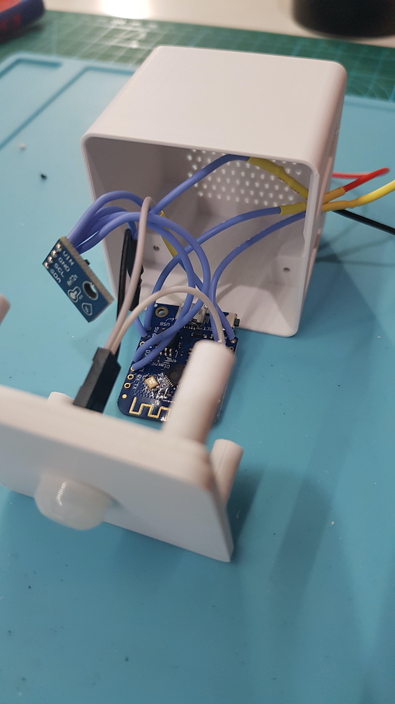

# Vindriktning-plus
Updated Vindriktning with Wifi Connectivity, Motion sensor, Temperature and Humidity

Inspired & parts of the code are used from: https://github.com/Hypfer/esp8266-vindriktning-particle-sensor

This is my "Backpack" for the Vindriktning PM25 sensor. Housing is adjusted to the IKEA housing.
Work is still in progress.

Addtional to the print you need:
- Wemos D1
- AHT21 sensor
- Mini PIR sensor
- 4 x M2x10 self tapping

Who needs color coding! Used some old leftover wire...

Connect Vindriktning and Backpack via VHB tape, any other glue will work too.

Before closing the packpack, close the connection hole with hotglue to prevent warm air circulation through the backpack.

